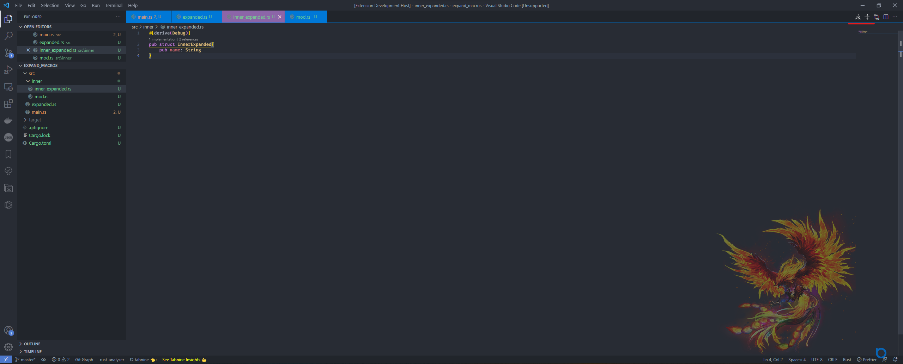

# Rust Macro Expand

VS Code extension for expanding macros in Rust code. Enables macro expansion based on module, crate or any other parameters supported by the [cargo-expand](https://github.com/dtolnay/cargo-expand) crate.  

##### **Enables** reloading expanded macros on file save, saving you precious time while working with macros.

## Requirements

Requires that you have the following installed:

* [cargo-expand](https://github.com/dtolnay/cargo-expand) A cargo crate for easier handling of compiler commands
* Rust nightly compiler, you can install it with `rustup toolchain install nightly`

## Features

### Commands  

This extension offers 5 commands to handle various use cases when expanding macros in Rust code.  
The commands are as follows (long version first followed by the short version):

* `Expand Macros`, `rustex`: Expand macros in the current file. Tries to find the module in which the current file resides and expands the macros in it. If it doesn't exist defaults to crate expand.  

* `Expand Crate Macros`, `rustexc`: Expand macros in the current crate. Determines which crate it is by searching for the Cargo.toml file in the directory structure of the current file.  

* `Reload Expanded Macros`, `rustexr`: Reload expand in already expanded file. Will use the same command and path as the original command.  

* `Expand Custom Command`, `rustexcc`: Enables passing any valid command to [cargo-expand](https://github.com/dtolnay/cargo-expand). Check the [cargo-expand docs](https://github.com/dtolnay/cargo-expand) for valid commands.  

* `Expand Custom Path`, `rustexp`: Enables passing any valid command to [cargo-expand](https://github.com/dtolnay/cargo-expand), as well as the absolute system path in which the command will be executed. Check the [cargo-expand docs](https://github.com/dtolnay/cargo-expand) for valid commands.  

### Quick Actions

#### Depending on the file context, the extension exposes icons next to Editor Groups
* `Expand Macros`, `Expand Crate Macros`, `Reload Expanded Macros`   

## Extension Settings
The following settings are available:

* `rustMacroExpand.displayWarnings`: Specifies whether or not to display warnings in the generated output. Warnings will be displayed as a multiline comment at the top of the generated output.
* `rustMacroExpand.notifyWarnings`: Specifies whether or not to display warnings as an action in a notification. After expand has been completed, if there were any warnings you will get a notification with a button which upon click will display the warnings in a spearate window.
* `rustMacroExpand.displayCargoCommand`: Specifies whether or not to display in the generated output the command sent to cargo expand.
* `rustMacroExpand.displayCargoCommandPath`: Specifies whether or not to display in the generated output the folder in which the cargo expand command was executed.
* `rustMacroExpand.displayTimestamp`: Specifies whether or not to display the timestamp in the generated output.
* `rustMacroExpand.expandOnSave`: Specifies whether or not to refresh expanded files on save.

## Contributing

Contributions of any kind are welcome and encouraged.

[GitHub Project Page](https://github.com/Odiriuss/rust-macro-expand)

## Release Notes

### 1.0.0

Initial release of Rust Macro Expand
